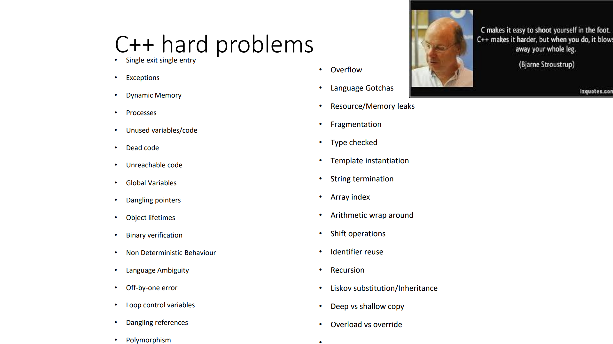

# C++ Safety and Critical

- [C++ Safety and Critical](#c-safety-and-critical)
  - [Topics](#topics)
  - [C++ Hard Problems](#c-hard-problems)
  - [Safety Critical APIs](#safety-critical-apis)
  - [MISRA](#misra)
    - [MISRA C](#misra-c)
    - [MISRA C++](#misra-c-1)
  - [Study Links](#study-links)

## Topics

- From [1]
  - C++ topics related to Safety and Critical
    - RAII
    - Templates
    - Regular Types
    - Exceptions/ Error Codes
    - C++11 Smart Pointers
    - C++11/14 Lambdas
    - C++17 Parallel Algorithm
    - C++20 Contracts, Concepts

## C++ Hard Problems

- From [1]
  - 

## Safety Critical APIs

- From [1]
  - Misra C and C++
  - Autosar C++ Guidelines
  - High Integrity C++
  - WG23 Programming Vulnerabilities
  - C++ Core Guidelines
  - C++ Study Gorup 12 Vulnerabilities
  - C Safe and Secure Study Group
  - Carnegie Mellon Cert C and C++
  - Joint Strike Fighter ++
  - Common Weakness Enumeration
  - Khronos Safety Critical Advisory Forum
  - OpenCL/SYCL Safety Critical
  - Vulkan Safety Critical
  - HTC1/SC42 Machine Learning WG3 Trustworthiness
  - TC22/SC32 SOTIF WG8 SOTIF

## MISRA

### MISRA C

- From [1]
  - Versions
    - 1998
      - Guidelines for the use of the C language in vehicle based software
        - MISRA C:1998 (MISRA C1)
    - 2004
      - Guidelines for the use of the C language in critical systems
        - MISRA C:2004 (MISRA C2)
    - 2013
      - Guidelines for the use of the C language in critical systems
        - MISRA C:2012 (MISRA C3)
        - 159 rules of which 138 are statically enforceable

### MISRA C++

- From [1]
  - Versions
    - 2008
      - Guidelines for the use of the C++ language in critical systems
        - 228 rules of which 219 are statically enforceable
  - MISRA 2008 forbids dynamic memory

## Study Links

- [1]
  - <http://purecpp.org/static/bbd0fe3218f940b3a088450be28e8ed8.pdf>
    - Writing Safety Critical C++ Software for High Performance hardware
- [2]
  - <https://www.appinf.com/download/SafetyCriticalC++.pdf>
    - C++ for Safety-Critical Systems
