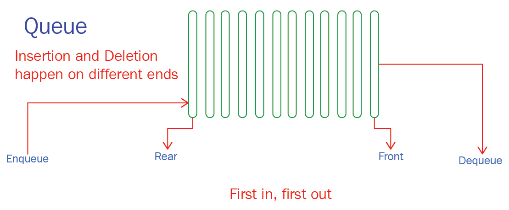

# `std::queue`

```cpp
#include <iostream>
#include <queue>

int main() {
    std::queue<char> q;

    q.push('a');
    q.push('b');
    q.push('c');
    std::cout << q.front();    // prints 'a'
    std::cout << q.back();     // prints 'c'
    q.pop();
    std::cout << q.front();    // prints 'b'

    return 0;
}
```


