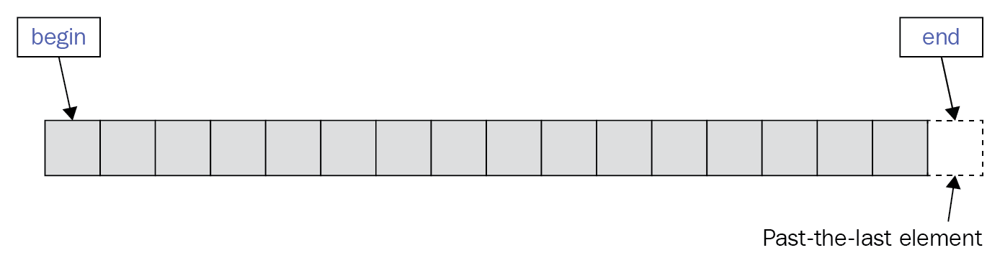
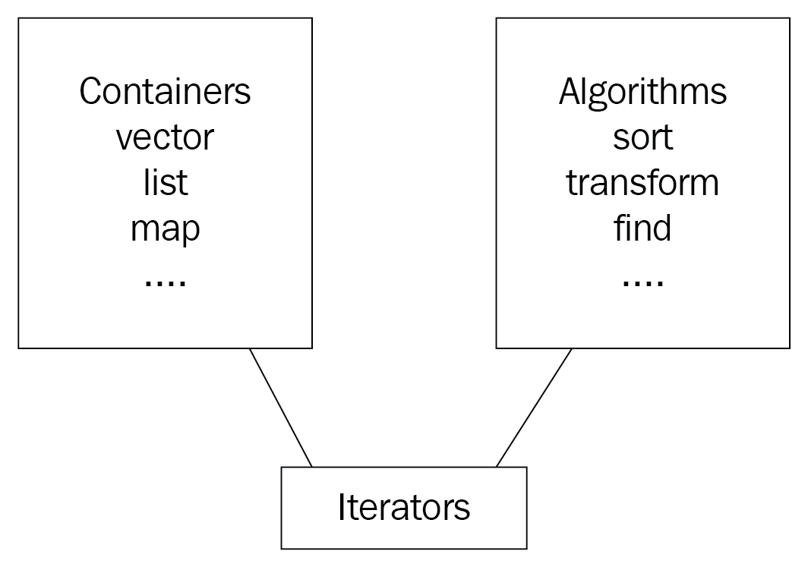

# C++ Iterator and Concepts

## Iterators (Legacy)

An **iterator** is an object that points to the container element and can be advanced to the next element based on the physical structure of the container.

```cpp
// std::vector is a contiguous container
std::vector<int> vec{1, 2, 3};
std::vector::iterator it(vec.begin());
```



```cpp
// std::list is a node-based container
std::list<double> lst{1.1, 2.2, 3.3, 4.4, 5.5};

// Traverse using range loop (relies on iterators)
for(auto & elem : lst) {
    std::cout << elem;
}
std::cout << std::endl;

// Traverse using iterators
auto it_begin = std::begin(lst);
auto it_end = std::end(lst);
for(; it_begin != it_end; ++it_begin) {
    std::cout << *it_begin;
}
std::cout << std::endl;
```

`std::begin()` and `std::end()` functions typically call the container's `begin()` and `end()` methods respectively

    - `std::begin()` ==> `class->begin()`
    - `std::end()` ==> `class->end()`

Each containerhas its own implementation; hence list and vector iterators have the same interface but behave differently.
The behavior of the iterator is defined by its _**category**_.



### Iterator Categories (Legacy)

- Input
  - The `input iterator` provides read access (by calling the `*` operator) and enables forwarding the iterator position using prefix and suffix increment operators.
  - An input iterator doesn't support multiple passes, that is, we can use an iterator to iterate over the container only once.
- Output (the same as input, but supporting write access)
  - The `output iterator` doesn't provide access to the element, but it allows assigning new values to it.
- Forward
  - A combination of both `input iterator` and `output iterator` with multiple passes feature comprises the forward iterator
  - The `forware iterator`, is both an input iterator and output iterator, that supports multiple passes.
  - Multi-pass support means we can read the value of the element through the iterator more than once
- Bidirectional
  - The `bidirectional iterator` supports moving the iterator to any position
  - They support decrementing operations
    - For example, the `std::list` supports bidrectional iterator
- Random access
  - The `random access iterator` supports/allows _jumping_ through elements by adding/subtracting a number to/from the iterator.
  - The iterator will jump to the position specified by the arithmetic operation
    - For example, the `std::vector` provides random access iterator
- Contiguous
  - A combination of all of the features above falls into the `contiguous iterator` category
    - For example, the `std::array` provides contiguous iterator

##  Concepts (C++20)

- C++20 introduced **concepts** as one of its major features.
- C++20 introduced new _iterators_ based on _concepts_

- C++ Templates provided classes flexibility by reusing them for various aggregate types.
    ```cpp
    std::vector<int> ivec;
    std::vector<Person> persons;
    std::vector<std::vector<double>> float_matrix;
    ```
    ```cpp
    template <typename T>
    class Wallter
    {
        // The body of the class using the T type
    };
    ```

- C++20 Concepts allows to set restrictions on template parameters, check for constraints and discover inconsistent behavior at compile time.
    ```cpp
    template <addable T>
    class Wallet
    {
        // The body of the class using addable T's
    };
    ```

    ```cpp
    class Book
    {
        // doesn't have an operator+
    };

    constexpr bool operator+(const Money& a, const Money& b) {
        return Money(a.value_ + b.value_);
    }

    class Money
    {
        friend constexpr bool operator+(const Money&, const Money&);
    private:
        double value_;
    }

    Wallet<Money> w;    // works fine
    Wallet<Book>  g;    // compile error
    ```
- A conept is declared using templates. That is, we can refer them as types that describe other types.
- The declaration of a concept is done using the `concept` keyword and has the follwing form:
    ```cpp
    template <parameter-list>
    concept name-of-the-concept = constraint-expression;
    ```
- Concepts rely heavily on _**constraints**_.
  - A constraint is a way to specify requirements for template arguments.
    ```cpp
    template <typename T>
    concept addable = requires (T obj) { obj + obj; };
     ```
  - Standard concepts are defined in `<concepts>` header
    - `readable`
    - `writable`
    - `incrementable`
  - We can also combine several concerpts into one by requiring the new concept to support the others.
    - To achieve hat we use the `&&` operator.
    ```cpp
    template <typename T>
    concept incrementable = std::regular<T> && std::weakly_incrementatble<T>
                && requires (T t) { {t++} -> std::same_as<T>; };
    ```

### Iterator Concepts

- `input_iterator`
  - specifies that the type allows its referenced values to be read and is both pre- and post- **incrementable**
- `output_iterator`
  - specifies that values of the type can be written to and the type is both pre- and post- **incrementable**
- `input_or_output_iterator`
  - specifies that the type is **incrementable** and can be deferenced
- `forward_iterator`
  - specifies that the type is an `input_iterator` and additionally supports equality comparision and multi-pass
- `bidirectional_iterator`
  - specifies that the type supports `forward_iterator` and additionally supports the backward movement
- `random_access_ierator`
  - specifies that the type as a `bidirectional_iterator`, supporting advancement in constant time and subscripting
- `contiguous_iterator`
  - specifies that the type is a `random_iterator`, referring to elements that are contiguous in memory

## TO DO

- Link to Named Requirements related to Iterators
- `const_iterator`
- `bidirectional iterator`

## Links

- <https://en.cppreference.com/w/cpp/iterator>
