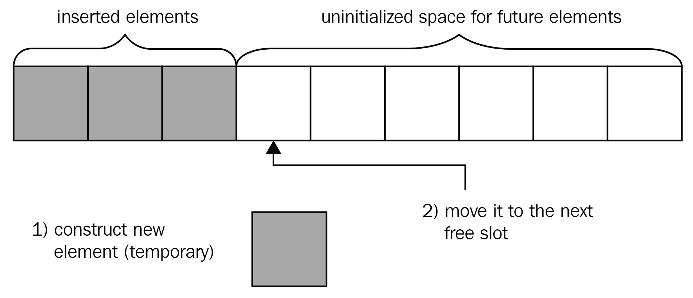

# `std::vector`

- Requirement for the vector
  - The type should be `MoveInsertable`

## `std::vector<bool>`

    *) std::vector<bool> is not a container
    *) It will give proxy container only, so if you want to modify iterator value, you need to use rvalue reference (&&) not a lvalue reference (&)

### `push_back`

- When you do `push_back`
  - A temporary object is created with the input argument
  - And then temporary object is moved into container

```cpp
struct Point {
    float x;
    float y;
    float z;

    Point(float ax, float ay, float az): x{ax}, y{ay}, z{az} {}
    Point(point && px) : x{px}, y{py}, z{pz} {}
};

std::vector<Point> points;
points.push_back(Points(1.1, 2.3, 3.3));
```



### `emplace_back`

- When you do `emplace_back`
  - new object is created in container itself
  - copy constructor is invoked over the newly created object with the parameters passed to emplace_back
    - basically it invokes the constructor of the object (deduced from the `emplace_back` args)
- instead of `push_back`, insertion happens in single step

```cpp
points.emplace_back(1.1, 2.2, 3.3); // Pass the constructor args directly
```


- `emplace_back` constructs the element through `std::allocator_traits::construct()`
  - `std::allocator_traits::construct()` uses _placement new_ oeprator to construct the element at already allocated uninitialized space

## TO DO

    - clear vector memory
        swap() 
    - vector<int> bigarray(N);
        memory set to 0
        why?

## Links

- [1] Expert C++ <https://learning.oreilly.com/library/view/expert-c/9781838552657/83d855cc-c7c7-443a-9c6f-8f54a187b7be.xhtml>
  - by Vardan Grigoryan; Shunguang Wu
Published by Packt Publishing, 2020
